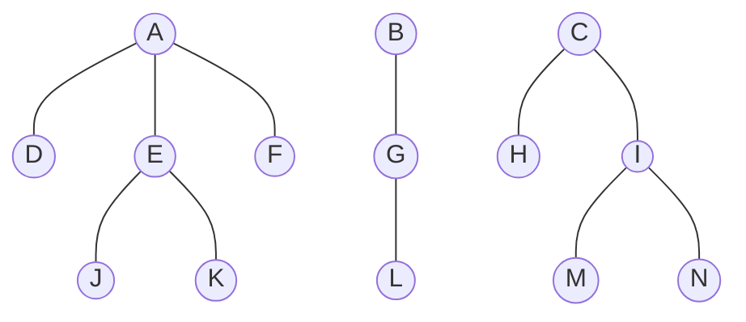

# DSA 数据结构与算法B笔试（无答案版本）

Updated 1313 GMT+8 Jun 9, 2025

2024 spring, Complied by Hongfei Yan


# 全是选择（Python）

## 1.1 绪论（5个题）

（1）在数据结构中，从逻辑上可以把数据结构分成（   ）。

A．动态结构和静态结构   B．紧凑结构和非紧凑结构

C．线性结构和非线性结构  D．内部结构和外部结构

（2）与数据元素本身的形式、内容、相对位置、个数无关的是数据的（  ）。

A．存储结构        B．存储实现

C．逻辑结构        D．运算实现

（3）通常要求同一逻辑结构中的所有数据元素具有相同的特性，这意味着(  )。

A．数据具有同一特点

B．不仅数据元素所包含的数据项的个数要相同，而且对应数据项的类型要一致

C．每个数据元素都一样

D．数据元素所包含的数据项的个数要相等

（4）以下说法正确的是（  ）。

A．数据元素是数据的最小单位

B．数据项是数据的基本单位

C．数据结构是带有结构的各数据项的集合

D．一些表面上很不相同的数据可以有相同的逻辑结构

（5）以下与数据的存储结构无关的术语是（  ）。
A．顺序队列    B. 链表    C. 有序表     D. 链栈


## 1.2 线性表（14个题）

（1）在n个结点的顺序表中，算法的时间复杂度是O(1)的操作是（  ）。

A．访问第i个结点（1≤i≤n）和求第i个结点的直接前驱（2≤i≤n） 

B．在第i个结点后插入一个新结点（1≤i≤n）

C．删除第i个结点（1≤i≤n）

D．将n个结点从小到大排序

（2）向一个有127个元素的顺序表中插入一个新元素并保持原来顺序不变，平均要移动 的元素个数为（  ）。
A．8   B．63.5    C．63   D．7

（3）链接存储的存储结构所占存储空间（  ）。

A．分两部分，一部分存放结点值，另一部分存放表示结点间关系的指针

B．只有一部分，存放结点值

C．只有一部分，存储表示结点间关系的指针

D．分两部分，一部分存放结点值，另一部分存放结点所占单元数

（4）线性表若采用链式存储结构时，要求内存中可用存储单元的地址（  ）。

A．必须是连续的    B．部分地址必须是连续的

C．一定是不连续的   D．连续或不连续都可以

（5）线性表Ｌ在（   ）情况下适用于使用链式结构实现。

A．需经常修改Ｌ中的结点值   Ｂ．需不断对Ｌ进行删除插入 

C．Ｌ中含有大量的结点     Ｄ．Ｌ中结点结构复杂

（6）单链表的存储密度（  ）。
A．大于1    B．等于1   C．小于1  D．不能确定

（7）将两个各有n个元素的有序表归并成一个有序表，其最少的比较次数是（  ）。
A．n       B．2n-1     C．2n     D．n-1

（8）在一个长度为n的顺序表中，在第i个元素（1≤i≤n+1）之前插入一个新元素时须向后移动（  ）个元素。
A．n-i      B．n-i+1    C．n-i-1    D．i

（9）线性表L=(a1，a2,……an)，下列说法正确的是（  ）。

A．每个元素都有一个直接前驱和一个直接后继

B．线性表中至少有一个元素

C．表中诸元素的排列必须是由小到大或由大到小

D．除第一个和最后一个元素外，其余每个元素都有一个且仅有一个直接前驱和直接后继。

（10）若指定有n个元素的向量，则建立一个有序单链表的时间复杂性的量级是（  ）。
A．O(1)      B．O(n)       C．$O(n^2)$      D．$O(nlog_2n)$

（11）以下说法错误的是（  ）。

A．求表长、定位这两种运算在采用顺序存储结构时实现的效率不比采用链式存储结构时实现的效率低

B．顺序存储的线性表可以随机存取

C．由于顺序存储要求连续的存储区域，所以在存储管理上不够灵活

D．线性表的链式存储结构优于顺序存储结构

（12）在单链表中，要将s所指结点插入到p所指结点之后，其语句应为（  ）。

A. s.next = p.next + 1; p.next = s;

B. p.next = s; s.next = p.next;

C. s.next = p.next; p.next = s.next;

D. s.next = p.next; p.next = s;

（13）在双向链表存储结构中，删除p所指的结点时须修改指针（  ）。

A. p.next.prior = p.prior; p.prior.next = p.next;

B. p.next = p.next.next; p.next.prior = p;

C. p.prior.next = p; p.prior = p.prior.prior;

D. p.prior = p.next.next; p.next = p.prior.prior;

（14）在双向循环链表中，在p指针所指的结点后插入q所指向的新结点，其修改指针的操作是（  ）。

A. p.next = q; q.prior = p; p.next.prior = q; q.next = q;

B. p.next = q; p.next.prior = q; q.prior = p; q.next = p.next;

C. q.prior = p; q.next = p.next; p.next.prior = q; p.next = q;

D. q.prior = p; q.next = p.next; p.next = q; p.next.prior = q;


## 1.3 栈和队列（15个题）

（1）若让元素1，2，3，4，5依次进栈，则出栈次序不可能出现在（  ）种情况。

A．5，4，3，2，1  B．2，1，5，4，3   C．4，3，1，2，5   D．2，3，5，4，1

（2）若已知一个栈的入栈序列是1，2，3，…，n，其输出序列为p1，p2，p3，…，pn，若p1=n，则pi为（ ）。

  A．i        B．n-i        C．n-i+1      D．不确定

（3）数组Ｑ［ｎ］用来表示一个循环队列，ｆ为当前队列头元素的前一位置，ｒ为队尾元素的位置，假定队列中元素的个数小于ｎ，计算队列中元素个数的公式为（  ）。

A．r-f       B．(n+f-r)%n    C．n+r-f      D．（n+r-f)%n

（4）链式栈结点为：(data,link)，top指向栈顶.若想摘除栈顶结点，并将删除结点的值保存到x中,则应执行操作（）。

A．x=top.data;top=top.link；    B．top=top.link;x=top.link；  

C．x=top;top=top.link；        D．x=top.link；

（5）设有一个递归算法如下

```python
def fact(n):  #n大于等于0
    if n <= 0:
        return 1
    else:
        return n * fact(n - 1)
```

则计算fact(n)需要调用该函数的次数为（  ）。 

A． n+1       B． n-1        C． n         D． n+2

（6）栈在 （  ）中有所应用。

A．递归调用    B．函数调用   C．表达式求值    D．前三个选项都有

（7）为解决计算机主机与打印机间速度不匹配问题，通常设一个打印数据缓冲区。主机将要输出的数据依次写入该缓冲区，而打印机则依次从该缓冲区中取出数据。该缓冲区的逻辑结构应该是（  ）。

A．队列      B．栈       C． 线性表      D．有序表

（8）设栈S和队列Q的初始状态为空，元素e1、e2、e3、e4、e5和e6依次进入栈S，一个元素出栈后即进入Q，若6个元素出队的序列是e2、e4、e3、e6、e5和e1，则栈S的容量至少应该是（  ）。

A．2        B．3       C．4        D． 6

（9）在一个具有n个单元的顺序栈中，假设以地址高端作为栈底，以top作为栈顶指针，则当作进栈处理时，top的变化为（  ）。 

A．top不变    B．top=0      C．top -= 1       D．top += 1

（10）设计一个判别表达式中左，右括号是否配对出现的算法，采用（  ）数据结构最佳。

A．线性表的顺序存储结构       B．队列   

C. 线性表的链式存储结构        D. 栈

（11）用链接方式存储的队列，在进行删除运算时（  ）。

A. 仅修改头指针            B. 仅修改尾指针

C. 头、尾指针都要修改        D. 头、尾指针可能都要修改

（12）循环队列存储在数组A[0..m]中，则入队时的操作为（  ）。

A. rear=rear+1            B. rear=(rear+1)%(m-1)

 C. rear=(rear+1)%m          D. rear=(rear+1)%(m+1)

（13）最大容量为n的循环队列，队尾指针是rear，队头是front，则队空的条件是（  ）。

 A. (rear+1)%n == front          B. rear == front                             

C．rear+1 == front           D. (rear-1)%n == front

（14）栈和队列的共同点是（  ）。

A. 都是先进先出            B. 都是先进后出  

C. 只允许在端点处插入和删除元素    D. 没有共同点

（15）一个递归算法必须包括（  ）。

A. 递归部分              B. 终止条件和递归部分

C. 迭代部分              D. 终止条件和迭代部分


## 1.4 串和数组（6个题）

（1）串是一种特殊的线性表，其特殊性体现在（  ）。

 A．可以顺序存储        B．数据元素是一个字符   

C．可以链式存储        D．数据元素可以是多个字符

（2）下面关于串的的叙述中，（  ）是不正确的？ 

A．串是字符的有限序列     B．空串是由空格构成的串

C．模式匹配是串的一种重要运算 D．串既可以采用顺序存储，也可以采用链式存储

（3）串的长度是指（  ）。

A．串中所含不同字母的个数    B．串中所含字符的个数

C．串中所含不同字符的个数    D．串中所含非空格字符的个数

（4）若对n阶对称矩阵A以行序为主序方式将其下三角形的元素(包括主对角线上所有元素)依次存放于一维数组B[1..(n(n+1))/2]中，则在B中确定$a_{ij}（i<j）$的位置k的关系为（  ）。

A．i*(i-1)/2+j    B．j * (j-1)/2+i   C．i * (i+1)/2+j   D．j * (j+1)/2+i

（5）A[N，N]是对称矩阵，将下面三角（包括对角线）以行序存储到一维数组T[N(N+1)/2]中，则对任一上三角元素a\[i][j]对应T[k]的下标k是（  ）。<mark>重复了，同前一个题目(4)</mark>

A．i(i-1)/2+j    B．j(j-1)/2+i    C．i(j-i)/2+1    D．j(i-1)/2+1

（6）设二维数组A[1.. m，1.. n]（即m行n列）按行存储在数组B[1.. m*n]中，则二维数组元素A[i,j]在一维数组B中的下标为（  ）。

A．(i-1) * n+j    B．(i-1) * n+j-1   C．i * (j-1)     D．j * m+i-1


## 1.5 树和二叉树（10个题）

（1）把一棵树转换为二叉树后，这棵二叉树的形态是（  ）。       

A．唯一的              Ｂ．有多种

C．有多种，但根结点都没有左孩子  Ｄ．有多种，但根结点都没有右孩子

（2）由3 个结点可以构造出多少种不同的二叉树？（  ）

A．2     B．3       C．4     D．5  

（3）一棵完全二叉树上有1001个结点，其中叶子结点的个数是（  ）。

A．250     B． 500     C．254    D．501  

（4）一个具有1025个结点的二叉树的高h为（  ）。设独根树深度为0。

A．11     B．10       C．11至1025之间    D．10至1024之间

（5）深度为h的满m叉树的第k层有（ A ）个结点。(1=<k=<h)

A．m^k-1^      B．m^k^-1      C．m^h-1^     D．m^h-1

（6）对二叉树的结点从1开始进行连续编号，要求每个结点的编号大于其左、右孩子的编号，同一结点的左右孩子中，其左孩子的编号小于其右孩子的编号，可采用（  ）遍历实现编号。

A．先序     B. 中序      C. 后序    D. 从根开始按层次遍历

（7）若二叉树采用二叉链表存储结构，要交换其所有分支结点左、右子树的位置，利用（  ）遍历方法最合适。

A．前序     B．中序       C．后序   D．按层次

（8）在下列存储形式中，（  ）不是树的存储形式？

A．双亲（parent）表示法  B．孩子链表表示法  C．孩子兄弟表示法  D．顺序存储表示法

（9）一棵非空的二叉树的先序遍历序列与后序遍历序列正好相反，则该二叉树一定满足（  ）。

A．所有的结点均无左孩子    B．所有的结点均无右孩子

C．只有一个叶子结点      D．是任意一棵二叉树

（10）设F是一个森林，B是由F变换得的二叉树。若F中有n个非终端结点，则B中右指针域为空的结点有（  ）个。

A． n-1      B．n           C． n+1      D． n+2


## 1.6 图（15个题）

（1）在一个图中，所有顶点的度数之和等于图的边数的（  ）倍。

 A．1/2      B．1       C．2       D．4 

（2）在一个有向图中，所有顶点的入度之和等于所有顶点的出度之和的（  ）倍。

 A．1/2       B．1       C．2       D．4 

（3）具有n个顶点的有向图最多有（  ）条边。 

A．n        B．n(n-1)     C．n(n+1)    D．n^2 

（4）n个顶点的连通图用邻接距阵表示时，该矩阵至少有（   ）个非零元素。

A．n        B．2(n-1)     C．n/2      D．n^2 

（5）G是一个非连通无向图，共有28条边，则该图至少有（  ）个顶点。

A．7        B．8       C．9       D．10 

（6）若从无向图的任意一个顶点出发进行一次深度优先搜索可以访问图中所有的顶点，则该图一定是（  ）图。

A．非连通     B．连通      C．强连通    D．有向

（7）下面（  ）算法适合构造一个稠密图G的最小生成树。

A． Prim    B．Kruskal  C．Floyd   D．Dijkstra

（8）用邻接表表示图进行广度优先遍历时，通常借助（  ）来实现算法。

A．栈       B. 队列       C. 树      D．图 

（9）用邻接表表示图进行深度优先遍历时，通常借助（  ）来实现算法。

A．栈      B. 队列      C. 树      D．图 

（10）深度优先遍历类似于二叉树的（  ）。

A．先序遍历    B．中序遍历     C．后序遍历   D．层次遍历

（11）广度优先遍历类似于二叉树的（  ）。

A．先序遍历    B．中序遍历     C．后序遍历    D．层次遍历

（12）图的BFS生成树的树高比DFS生成树的树高（   ）。

A．小       B．相等       C．小或相等    D．大或相等

   

（13）已知图的邻接矩阵如图所示邻接矩阵，则从顶点0出发按深度优先遍历的结果是（  ）。

$$
\left[
\matrix{
  0 & 1 & 1 & 1 & 1 & 0 & 1 \\ 
  1 & 0 & 0 & 1 & 0 & 0 & 1 \\ 
  1 & 0 & 0 & 0 & 1 & 0 & 0 \\ 
  1 & 1 & 0 & 0 & 1 & 1 & 0 \\ 
  1 & 0 & 1 & 1 & 0 & 1 & 0 \\
  0 & 0 & 0 & 1 & 1 & 0 & 1 \\
  1 & 1 & 0 & 0 & 0 & 1 & 0
}
\right]
$$


​                 A．0 2 4 3 1 5 6    B．0 1 3 6 5 4 2    C．0 1 3 4 2 5 6    D．0 3 6 1 5 4 2             

（14）已知图的邻接表如图所示，则从顶点0出发按广度优先遍历的结果是（  ），按深度优先遍历的结果是（）。

​                 A．0 1 3 2    B．0 2 3 1     C．0 3 2 1    D．0 1 2 3                     


（15）下面（  ）方法可以判断出一个有向图是否有环。

A．深度优先遍历    B．拓扑排序    C．求最短路径   D．求关键路径


## 1.7 查找（13个题）

（1）对n个元素的表做顺序查找时，若查找每个元素的概率相同，则平均查找长度为（  ）。

A．(n-1)/2    B． n/2    C．(n+1)/2    D．n 

（2）适用于折半查找的表的存储方式及元素排列要求为（  ）。

 A．链接方式存储，元素无序       B．链接方式存储，元素有序

C．顺序方式存储，元素无序      D．顺序方式存储，元素有序

（3）当在一个有序的顺序表上查找一个数据时，既可用折半查找，也可用顺序查找，但前者比后者的查找速度（）。           

A．必定快              B．不一定  

C．在大部分情况下要快        D．取决于表递增还是递减

（4）折半查找有序表（4，6，10，12，20，30，50，70，88，100）。若查找表中元素58，则它将依次与表中（  ）比较大小，查找结果是失败。

A．20，70，30，50          B．30，88，70，50 

C．20，50               D．30，88，50

（5）对22个记录的有序表作折半查找，当查找失败时，至少需要比较（  ）次关键字。

A．3      B．4     C．5      D．6

（6）折半搜索与二叉排序树的时间性能（   ）。

 A．相同               B．完全不同    C．有时不相同            D．数量级都是$O(log_2n)$

（7）分别以下列序列构造二叉排序树，与用其它三个序列所构造的结果不同的是（  ）。 

A．（100，80， 90， 60， 120，110，130） 

B．（100，120，110，130，80， 60， 90）

C．（100，60， 80， 90， 120，110，130）

D．(100，80， 60， 90， 120，130，110)

（8）在平衡二叉树中插入一个结点后造成了不平衡，设最低的不平衡结点为A，并已知A的左孩子的平衡因子为0右孩子的平衡因子为1，则应作（  ）型调整以使其平衡。

A．LL      B．LR     C．RL      D．RR

（9）下列关于m阶B-树的说法错误的是（  ）。  

A．根结点至多有m棵子树   

B．所有叶子都在同一层次上

C．非叶结点至少有m/2 (m为偶数)或m/2+1（m为奇数）棵子树  

D．根结点中的数据是有序的

（10）下面关于哈希查找的说法，正确的是（  ）。    

A．哈希函数构造的越复杂越好，因为这样随机性好，冲突小   

B．除留余数法是所有哈希函数中最好的  

C．不存在特别好与坏的哈希函数，要视情况而定

D．哈希表的平均查找长度有时也和记录总数有关

（11）下面关于哈希查找的说法，不正确的是（  ）。       

 A．采用链地址法处理冲突时，查找一个元素的时间是相同的

 B．采用链地址法处理冲突时，若插入规定总是在链首，则插入任一个元素的时间是相同的

 C．用链地址法处理冲突，不会引起二次聚集现象

 D．用链地址法处理冲突，适合表长不确定的情况

（12）设哈希表长为14，哈希函数是H(key)=key%11，表中已有数据的关键字为15，38，61，84共四个，现要将关键字为49的元素加到表中，用二次探测法解决冲突，则放入的位置是（  ）。

   A．8       B．3       C．5       D．9 

（13）采用线性探测法处理冲突，可能要探测多个位置，在查找成功的情况下，所探测的这些位置上的关键字 (  A)。

A．不一定都是同义词          B．一定都是同义词    

C．一定都不是同义词         D．都相同


## 1.8 排序（15个题）

（1）从未排序序列中依次取出元素与已排序序列中的元素进行比较，将其放入已排序序列的正确位置上的方法，这种排序方法称为（  ）。

A．归并排序    B．冒泡排序    C．插入排序     D．选择排序 

（2）从未排序序列中挑选元素，并将其依次放入已排序序列（初始时为空）的一端的方法，称为（   ）。

A．归并排序    B．冒泡排序    C．插入排序    D．选择排序 

（3）对n个不同的关键字由小到大进行冒泡排序，在下列（  ）情况下比较的次数最多。

A．从小到大排列好的         B．从大到小排列好的  

 C．元素无序             D．元素基本有序

（4）对n个不同的排序码进行冒泡排序，在元素无序的情况下比较的次数最多为（   ）。

A．n+1      B．n        C．n-1        D．n(n-1)/2

（5）快速排序在下列（  ）情况下最易发挥其长处。

A．被排序的数据中含有多个相同排序码  

B．被排序的数据已基本有序  

C．被排序的数据完全无序     

D．被排序的数据中的最大值和最小值相差悬殊

（6）对n个关键字作快速排序，在最坏情况下，算法的时间复杂度是（  ）。

A．O(n)      B．O(n^2)       C．$O(nlog_2n)$     D．O(n^3) 

（7）若一组记录的排序码为（46, 79，56，38，40，84），则利用快速排序的方法，以第一个记录为基准得到的一次划分结果为（  ）。

A．38，40，46，56，79，84        B．40，38，46，79，56，84

C．40，38，46，56，79，84        D．40，38，46，84，56，79

（8）下列关键字序列中，（  ）是堆。

A．16，72，31，23，94，53        B．94，23，31，72，16，53 

C．16，53，23，94，31，72        D．16，23，53，31，94，72

（9）堆是一种（  ）排序。

A．插入     B．选择     C．交换    D．归并

（10）堆的形状是一棵（  ）。

A．二叉排序树      B．满二叉树     C．完全二叉树   D．平衡二叉树

（11）若一组记录的排序码为（46，79，56，38，40，84），则利用堆排序的方法建立的初始堆为（  ）。

A．79，46，56，38，40，84        B．84，79，56，38，40，46      

C．84，79，56，46，40，38        D．84，56，79，40，46，38

（12）下述几种排序方法中，要求内存最大的是（   ）。

A．希尔排序     B．快速排序     C．归并排序    D．堆排序

（13）下述几种排序方法中，（  ）是稳定的排序方法。

A．希尔排序     B．快速排序     C．归并排序    D．堆排序

（14）数据表中有10000个元素，如果仅要求求出其中最大的10个元素，则采用(  )算法最节省时间。

A．冒泡排序     B．快速排序     C．简单选择排序  D．堆排序

（15）下列排序算法中，（  ）不能保证每趟排序至少能将一个元素放到其最终的位置上。

A．希尔排序     B．快速排序     C．冒泡排序    D．堆排序


# 20240618笔试（Python）

## 一．选择题（30 分，每小题 2 分）

1. 设栈的输入序列是1 2 3 4 5，则（    ）不可能是其出栈序列。
A. 23415   B. 54132  C. 23145   D. 15432

2. 对线性表进行二分法查找，其前提条件是（   ）。
A. 线性表以链接方式存储，并且按关键码值排好序
B．线性表以链接方式存储，并且按关键码值的检索频率排好序
C．线性表以顺序方式存储，并且按关键码值排好序
D．线性表以顺序方式存储，并且按关键码值的检索频率排好序

3. 对于二叉树中的一个结点N，如果其左子树的高度为h1，右子树的高度为h2，则以N为根结点子树高度为（）。
A. max(h1, h2)  B. min(h1, h2)  C. max(h1, h2) + 1  D. min(h1, h2) + 1

4. 在插入排序算法中，如果待排序的序列已经是有序的，则插入排序算法的时间复杂度为（   ）。
A. $O(n^2)$     B. O(n log n)    C. O(n)   D. O(1)

5. 下列哪个概念属于存储结构？（   ）。
A. 线性表    B. 链表   C. 栈    D. 队列

6. 在二分查找算法中，每次比较后都将搜索范围缩小一半，若要在长度为n的数组中查找一个元素，最坏情况下需要比较多少次（  ）。
A. n    B. ⌊n/2⌋   C. ⌊log n⌋   D. ⌊log n⌋ + 1 

7. 在一个具有n个结点的有序单链表中插入一个新结点并仍保持其有序，其平均时间复杂度为（  ）。
A. O(nlog n)   B. O(1)    C. O(n)          D. O(n2)

8. 假设有4棵结点关键码为整数的二叉树，若它们的中序遍历序列分别如下， 请问其中可能是二叉搜索树（二叉排序树）的是（ B  ）。
A. 5, 3, 1, 2, 4  B. 1, 2, 3, 4, 5   C. 5, 3, 4, 2, 1  D. 1, 3, 5, 4, 2

9. 假设线性表有2n（n>100）个元素，以下操作（  ）在单链表上实现比在顺序表上实现效率更高。
A. 在表中最后一个元素的后面插入一个新元素
B. 顺序输出表中的前i个元素
C. 交换表中第i个元素和第 n+i个元素的值 (i=0, …, n-1)
D. 删除表中第1个元素

10. 用数组 Q[n] 实现循环队列，设队头的前一个元素的下标为f ，队尾的下标为 r， 则该队列中元素总数是（）。
A. r - f     B. (n + f - r) % n   C. n + r - f   D. (n + r - f) % n

11. 对于一个拥有21条边的非连通无向图，其至少包括（  ）个顶点。
A.5     B.6     C.7      D.8

12. 若使用分治算法解决某一问题，每次把规模为n的问题分解为2个规模为n/2的子问题，将两个子问题的结果合并的时间开销为O(n)，那么这个算法的总时间复杂度为（  ）。
A. O(n)          B. O(n log n)      C. $O( n^2 )$     D. $O(n^2 log n)$

13. 有n个顶点m条边的无向图，下列说法中错误的是（  ） 。
A 采用邻接表储存，储存该图的空间复杂度为O (m+n) 。
B 若为稠密图，更倾向于采用邻接矩阵存储。
C 采用邻接表储存，删除一个顶点的最坏情况的时间复杂度为O (n+m) 。
D 若为稀疏图，深度优先周游的时间复杂度低于广度优先周游的时间复杂度。

14. 利用栈将表达式`3*2^(4+2*2-6*3)-5` （其中^为乘幂）转换为后缀表达式过程中，当扫描到6 时，运算符栈为 （  ）。

A. `*^(+*-`           B. `*^-`   C. `*^(+`             D. `*^(-`

15. 定义一棵没有1度结点的二叉树为满二叉树。对于一棵包含k个结点的满二叉树，其叶子结点的个数为（   ）。
A.   ⌊k/2⌋   B. ⌊k/2⌋-1  C.⌊k/2⌋+1   D.以上三个都有可能


## 二． 判断

（10分，每小题1分；对填写“Y”, 错填写“N”）

1. （  ）分治法和动态规划法都运用了将问题分解为规模较小的子问题的思想。
2. （  ）在链表中查找和删除一个元素的时间复杂度都是O(1)。
3. （  ）相比于顺序存储，完全二叉树更适合用链式表示存储。
4. （  ）通常不能通过一棵二叉树的前序遍历结点序列和后序遍历结点序列来确定这颗二叉树的完整结构。
5. （  ）二叉搜索树一定是满二叉树。
6. （  ）归并排序算法一定比简单插入排序算法的执行效率高。
7. （  ）在待排序元素为正序情况下，直接插入排序可能比快速排序的时间复杂度更小。
8. （  ）一个有n个结点的无向图，最少有一个连通分量。
9. （  ）图的遍历算法（如深度优先搜索DFS和广度优先搜索BFS）都只能用于无向图。
10. （  ）若连通无向图的边的权值互不相同，其最小生成树只有一个。


## 三． 填空（20分，每题2分）

1. 按照简单且高效的原则，如果经常需要在线性表头部进行插入和删除操作，最合适的存储结构是$\underline{\hspace{4cm}}$；如果需要随机存取，最合适的存储结构是$\underline{\hspace{4cm}}$。
2. 假设顺序表中包含6个数据元素{a，b，c，d，e，f},他们的查找概率分别为{0.12，0.25，0.23，0.2，0.05，0.15}，顺序查找时为了使查找成功的平均比较次数最少，则表中的数据元素的存放顺序应该是$\underline{\hspace{4cm}}$。
3. 已知某棵完全二叉树中有120个结点，则该二叉树的结点一共有$\underline{\hspace{4cm}}$层，有$\underline{\hspace{4cm}}$个叶子结点。
4. 已知一棵树的中序遍历序列为DBGEACF，后序遍历序列为DGEBFCA，则这棵树的前序遍历结果为$\underline{\hspace{4cm}}$。
5. 某段电文中只有a,b,c,d四种字符，各种字符出现的次数为：a出现1000次，b出现2000次，c出现6000次，d出现1000次，采用哈夫曼编码该电文的长度为$\underline{\hspace{4cm}}$个比特。
6. 一组记录的关键字为45，80，55，40，42，85，利用堆排序的方法，从最后一个非叶子结点开始调整，建立的初始最大堆为$\underline{\hspace{4cm}}$。
7. 设一棵m叉树中有$N_1$个度数为1的结点（度数表示子结点个数），$N_2$个度数为2的结点，……，$N_m$个度数为m的结点，则该m叉树中共有$\underline{\hspace{4cm}}$个终端结点（即叶结点）。
8. 设散列表的表长m=15，散列函数H(key)=key%11，表中已有4个结点：addr(16)=5，addr(37)=4，addr(50)=6，addr(70)=7，如果用线性探查处理冲突，关键字为38的结点的地址是$\underline{\hspace{4cm}}$。
9. 设森林F中有4棵树，第1、2、3、4棵树的结点个数分别为10、9、11、7，当把森林F转换成一棵二叉树后，其根结点的右子树中有$\underline{\hspace{4cm}}$个结点。
10. 一个无向图，如果边的数量m$\underline{\hspace{4cm}}$结点个数n，那么该图一定存在回路。


## 四． 简答（3题，共14分）

1. 对序列{H, E, B, L, G, A, F, J, I, C, D, K}中的关键码按字母序的升序重新排列，则：
a)   冒泡排序第一趟交换结束后的结果是？（1 分）
b)   二路归并排序第一趟归并后的结果是？（1 分）
c)   初始步长为4的希尔（shell）排序第一趟后的结果是 ？（2 分）

 


2. 在下列二叉排序树中删除结点“37”的基本过程是：首先寻找该结点左子树上的最大者r，并利用r辅助删除该结点。请画出删除该结点后的二叉排序树结构。（3分）

  

 


3. Dr. Stranger 的电脑感染了一种病毒。该病毒会将文档中的每种字母固定替换为另一种字母，且互不相同，可以看作文档所涉及字母集合上的双射函数。例如，文档 `D = {ab, ac, bc}`，涉及的字母集合为 `X = {a, b, c}`，病毒函数 `f：X -> X`，假设其中 `f(a) = b，f(b) = c，f(c) = a`，那么感染病毒后的文档 `D' = {bc, ba, ca}`。现在 Dr. Stranger 有一个重要文档 D，内容为 6 个按字典序排列的单词，涉及的字母集合为 `X = {a, b, c, d, e}`。该文档感染了病毒后，内容变为 `D' = {cebdbac, cac, ecd, dca, aba, bac}`。请你破解出该病毒规则 f，并还原出原文档 D 的内容。给出思路（2 分）、具体步骤（3 分）、最终答案（2 分）。


## 五．算法填空（4题，共26分）

**请注意：每个空最多填一条语句，不得使用分号连接多个表达式的写法。**

1. (6分) 链表操作。
下面的程序描述的是一个只带表尾指针的循环单链表的操作(表尾指针指向链表最后一个结点，最后一个结点的next指针指向链表的第一个结点)。先是将n个整数依次插入链表头部，然后删掉链表尾部m个元素，再往链表前部插入k个整数。请填空。

**输入**：
第1行是整数n(0 < n <= 100)
第2行是n个非负整数
第3行是整数m(0 <m <= 200)
第4行是整数k(0 < k <= 100)
第5行是k个非负整数

**输出**：
第1行：将链表中的元素依次输出（结果会是输入第2行的倒序）
第2行：将链表删除尾部m个元素后的结果输出。如果链表为空，输出 NULL
第3行：依次输出链表前部又插入输入中的第5行的k个整数后的结果

样例输入：
4
1 2 3 4
3
2 
100 200

样例输出：
4 3 2 1 
4 
200 100 4

 

```python
class Node:
    def __init__(self, data, next=None):
        self.data, self.next = data, next

class LinkedList:
    def __init__(self):
        self.tail = None  # 表尾指针，指向链表最后一个结点
    def pushFront(self, data):  # 在链表头部插入元素
        nd = Node(data)
        if self.tail is None:
            self.tail = nd
            nd.next = nd
        else:
            ___________(1)__________  # 2分
            self.tail.next = nd
    def popBack(self):  # 在链表尾部删除元素
        if self.tail is not None:
            if _________(2)_______________:  # 1分
                self.tail = None
            else:
                ptr = self.tail.next
                while _________(3)_________:  # 1分
                    ptr = ptr.next
                ptr.next = ptr.next.next
                _______(4)_____  # 1分
    def print(self):
        if self.tail is not None:
            ptr = self.tail.next
            print(ptr.data, end=" ")
            ptr = ptr.next
            while _______(5)___________:  # 1分
                print(ptr.data, end=" ")
                ptr = ptr.next
        else:
            print("NULL")
        print()

n = input()
a = list(map(int, input().split()))
Lst = LinkedList()
for x in a:
    Lst.pushFront(x)
Lst.print()
n = int(input())
for i in range(n):
    Lst.popBack()
Lst.print()
n = input()
b = list(map(int, input().split()))
for x in b:
    Lst.pushFront(x)
Lst.print()

```


2. (6分) 求二叉树的宽度。

给定一棵二叉树，求该二叉树的宽度。二叉树宽度定义：结点最多的那一层的结点数目。
**输入**：第一行是一个整数n，表示二叉树的结点个数。二叉树结点编号从0到n-1， n <= 100。接下来有n行，依次对应二叉树的编号为0,1,2....n-1的结点。
每行有两个整数，分别表示该结点的左儿子和右儿子的编号。如果第一个（第二个）数为-1则表示没有左（右）儿子
**输出**：输出1个整数，表示二叉树的宽度

样例输入
3
-1 -1
0 2
-1 -1

样例输出
2

 

```python
class BinaryTree:
    def __init__(self, data, left=None, right=None):
        self.data, self.left, self.right = data, left, right
    def countWidth(self):
        width = [0 for i in range(200)]  # width[i]记录第i层宽度
        def traversal(root, level):
            if root is None:
                return
            width[level] += 1
            ____________(1)________________  # 1分
            ____________(2)________________  # 1分
        traversal(self, 0)
        return max(width)
def buildTree():
    n = int(input())
    nodes = [BinaryTree(None) for i in range(n)]
    for nd in range(n):
        L, R = map(int, input().split())
        if L != -1:
            nodes[nd].left = nodes[L]
            _______(3)________  # 1分
        if R != -1:
            nodes[nd].right = nodes[R]
            _______(4)________  # 1分
    for i in range(n):
        if _______(5)________:  # 2分
            return nodes[i]
    return None
tree = buildTree()
print(tree.countWidth())
```


3. (7分) 用Prim算法求无向图最小生成树。
**输入**：第一行两个整数n,m ( n< 100)，表示图有n个结点，m条边。结点编号从0开始算。接下来有m行，每行三个数s e w, 表示边(s,e)的权值是w( w<1000)。
**输出**：输出最小生成树的所有边

输入样例：
4 4
0 1 8.5
1 2 4
2 3 9
3 1 7

输出样例：
(1,0)(2,1)(3,1)

  

```python
def prim(G):  # Prim算法求图G最小生成树，返回最小生成树的边的列表
    INF = 1 << 30  # 无穷大
    # G是邻接矩阵,矩阵中None表示没有边，顶点编号从0开始
    n = len(G)  # n是顶点数目，顶点编号0 - (n-1)
    dist = [INF for i in range(n)]  # 各顶点到已经建好的那部分树的距离
    used = [False for i in range(n)]  # 标记顶点是否已经被加入最小生成树
    prev = [None for i in range(n)]
    # 顶点i是通过边(i,prev[i])被加入最小生成树的
    doneNum = 0  # 已经被加入最小生成树的顶点数目
    edges = []  # 最小生成树的边的列表
    while ______(1)______:  # 1分
        if doneNum == 0:
            x = minDist = 0  # 顶点0最先被加入最小生成树
        else:
            x, minDist = None, INF
            for i in range(n):
                if not used[i] and ______(2)______:  # 1分
                    x, minDist = i, dist[i]
        ______(3)______  # 1分
        doneNum += 1
        if doneNum > 1:
            edges.append(______(4)______)  # 1分
        for v in range(n):
            if not used[v] and ____________________(5)_______________:  #2分
                dist[v] = G[x][v]
                ______(6)_______  # v是通过x连接到最小生成树的   #1分
    return edges


n, m = map(int, input().split())
G = [[None for i in range(n)] for j in range(n)]  # 邻接矩阵
for i in range(m):
    tmp = input().split()
    s, e, w = int(tmp[0]), int(tmp[1]), float(tmp[2])
    G[s][e] = G[e][s] = w
edges = prim(G)  # edges的元素是一个元组(u,v)，表示一条边
for e in edges:
    print(f"({e[0]},{e[1]})", end="")


```

 

 

4. (7分) 完成下列算法，计算一个无向图中所有连通分量的结点个数。
**输入**：图的结点数、边数和边的列表。
**输出**：每个连通分量的结点个数。

输入样例：
5
[(0, 1), (1, 2), (3, 4)]

输出样例：
[3, 2]

 

```python
def dfs(node, visited, graph, n):
    count = 1
    visited[node] = True
    for i in range(n):
        if i in graph[node] and _____(1)_____:  # 1分
            count += __________(2)
            __________  # 1分
    return count


def count_components(n, edges):
    graph = {i: [] for i in range(n)}
    for u, v in edges:
        _________(3)________  # 1分
        _________(4)________  # 1分

    visited = [False] * n
    components = []
    for i in range(n):
        if ______(5)_______:  # 1分
            components.append(____________(6)___________)  # 2分

            return components

        n = int(input())
        edges = eval(input())
        print(count_components(n, edges))

```


# 20230620笔试（Python）

## 一．选择题（30 分，每小题 2 分）

1. 下列叙述中正确的是（  ）。
   A：散列是一种基于索引的逻辑结构 
   B：基于顺序表实现的逻辑结构属于线性结构
   C：数据结构设计影响算法效率，逻辑结构起到了决定作用 
   D：一个逻辑结构可以有多种类型的存储结构，且不同类型的存储结构会直接影响到数据处理的效率

2. 在广度优先搜索算法中，一般使用什么辅助数据结构？（  ）。
   A: 队列   B: 栈
   C: 树       D: 散列

3. 若某线性表采取链式存储，那么该线性表中结点的存储地址（  ）。
   A：一定不连续 B：既可连续亦可不连续 C：一定连续 D：与头结点存储地址保持连续

4. 若某线性表常用操作是在表尾插入或删除元素，则时间开销最小的存储方式是（  ）。
   A：单链表    B：仅有头指针的单循环链表
   C：顺序表    D：仅有尾指针的单循环链表

5. 给定后缀表达式（逆波兰式）ab+-c*d-对应的中缀表达式是（  ）。
   A： a - b - c \* d    B：- ( a + b ) \* c -d
   C： a + b \* c - d   D： ( a + b ) \* ( - c - d )

6. 今有一空栈 S，基于待进栈的数据元素序列 a, b, c, d, e, f 依次进行进栈、进栈、出栈、进
   栈、进栈、出栈的操作，上述操作完成以后，栈 S 的栈顶元素为（  ）。

   A：f     B：c    C：a    D：d

7. 对于单链表，表头节点为 head，判定空表的条件是（  ）。
   A: head.next \== None
   B: head != None
   C: head.next \== head
   D: head \== None

8. 以下典型排序算法中，具有稳定排序特性的是（  ）。
   A:冒泡排序（Bubble Sort） B: 直接选择排序（Selection Sort） 

   C:快速排序（Quick Sort）    D:希尔排序（Shell Sort）

9. 以下关键字列表中，可以有效构成一个大根堆（即最大值二叉堆，最大值在堆顶）的序列是（  ）。
   A: 5 8 1 3 9 6 2 7    B: 9 8 1 7 5 6 2 33
   C: 9 8 6 3 5 1 2 7    D: 9 8 6 7 5 1 2 3

10. 以下典型排序算法中，内存开销最大的是（  ） 。
    A：冒泡排序    B：快速排序
    C：归并排序    D：堆排序

11. 排序算法依赖于对元素序列的多趟比较/移动操作（即执行多轮循环），第一趟结束后，任一元素
    都无法确定其最终排序位置的算法是（  ）。

    A：选择排序    B：快速排序    C: 冒泡排序    D：插入排序

12. 考察以下基于单链表的操作，相较于顺序表实现，带来更高时间复杂度的操作是（  ）。
    A：合并两个有序线性表，并保持合成后的线性表依然有序 
    B：交换第一个元素与第二个元素的值 
    C：查找某一元素值是否在线性表中出现 
    D：输出第 i 个（0<=i<n，n 为元素个数）元素

13. 已知一个整型数组序列，序列元素值依次为 ( 19，20，50，61，73，85，11，39 )，采用某种排序算法，在多趟比较/移动操作（即执行多轮循环）后，依次得到以下中间结果（每一行对应一趟）如下：
    （1）19 20 11 39 73 85 50 61
    （2）11 20 19 39 50 61 73 85
    （3）11 19 20 39 50 61 73 85
    请问，上述过程使用的排序算法是（  ）。

    A：冒泡排序
    B：插入排序
    C：希尔排序
    D：归并排序

14. 今有一非连通无向图，共有 36 条边，该图至少有（  ）个顶点。
    A：8  B：9 C：10  D：11

15. 令 G=(V, E) 是一个无向图，若 G 中任何两个顶点之间均存在唯一的简单路径相连，则下面说
    法中错误的是（  ）。
    A：图 G 中添加任何一条边，不一定造成图包含一个环 
    B：图 G 中移除任意一条边得到的图均不连通 
    C： 图 G 的逻辑结构实际上退化为树结构 
    D： 图 G 中边的数目一定等于顶点数目减 1


## 二．判断

（10 分，每小题 1 分；对填写“Y”, 错填写“N” ）

1. （  ）按照前序、中序、后序方式周游一棵二叉树，分别得到不同的结点周游序列，然而三种不同的周游序列中，叶子结点都将以相同的顺序出现。
2. （  ）构建一个含 N 个结点的（二叉）最小值堆，时间效率最优情况下的时间复杂度大 O 表示为 $O (N\log N)$
3. （  ）对任意一个连通的无向图，如果存在一个环，且这个环中的一条边的权值不小于该环中任意一个其它的边的权值，那么这条边一定不会是该无向图的最小生成树中的边。
4. （  ）通过树的周游可以求得树的高度，若采取深度优先遍历方式设计求解树高度问题的算法，算法空间复杂度大 O 表示为 O（树的高度）。
5. （  ）树可以等价转化二叉树，树的先序遍历序列与其相应的二叉树的前序遍历序列相同。
6. （  ）如果一个连通无向图 G 中所有边的权值均不同，则 G 具有唯一的最小生成树。
7. （  ）求解最小生成树问题的 Prim 算法是一种贪心算法。
8. （  ）使用线性探测法处理散列表碰撞问题，若表中仍有空槽（空单元），插入操作一定成功。
9. （  ）从链表中删除某个指定值的结点，其时间复杂度是 O(1)。
10. （  ）Dijkstra 算法的局限性是无法正确求解带有负权值边的图的最短路径。


## 三．填空（20 分，每题 2 分）

1. 定义二叉树中一个结点的度数为其子结点的个数。现有一棵结点总数为 101 的二叉树，其中度数为 1 的结点数有 30 个，则度数为 0 结点有 _ _ _ _ 个。

2. 定义完全二叉树的根结点所在层为第一层。如果一个完全二叉树的第六层有 23 个叶结点，则它的总结 点数可能为 _ _ _ _ （请填写所有 3 个可能的结点数，写对 1 个得 1 分，2 个得 1.5 分，写 错 1 个不得分）。

3. 对于初始排序码序列（51, 41, 31, 21, 61, 71, 81, 11, 91），用双指针原地交换实现，第 1 趟快速排序（以第一个数字为中值）的结果是： _ _ _ _ 。

4. 如果输入序列是已经正序，在(改进)冒泡排序、直接插入排序和直接选择排序算算法中， _ _ _ _ 算法最慢结束。

5. 已知某二叉树的先根周游序列为 ( A, B, D, E, C, F, G )，中根周游序列为 ( D, B, E, A, C, G, F )，则该二叉树的后根次序周游序列(  _ _ _ _  )。

6. 使用栈计算后缀表达式 (操作数均为一位数) “1 2 3 + 4 * 5 + 3 + −” ，当扫描到第二个+号但还未对该+号进行运算时，栈的内容 (以栈底到栈顶从左往右的顺序书写) 为 _ _ _ _ 。

7. 51 个顶点的连通图 G 有 50 条边，其中权值为 1, 2, 3, 4, 5, 6, 7, 8, 9, 10 的边各 5 条，则连通图 G 的最小生成树各边的权值之和为 _ _ _ _ _ 。

8. 包含 n 个顶点无向图的邻接表存储结构中，所有顶点的边表中最多有 _ _ _ _ 个结点。具有 n 个顶点的有向图，顶点入度和出度之和最大值不超过 _ _ _ _ 。

9. 给定一个长度为 7 的空散列表，采用双散列法解决冲突，两个散列函数分别为：h1(key) = key % 7，h2(key) = key%5 + 1 请向散列表依次插入关键字为 30, 58, 65 的集合元素，插入完成后 65 在散列表中存储地址为 _ _ _ _ _ 。

10. 阅读算法 ABC，回答问题。

    ```python
    def ABC(n):
      k, m = 2, int(n**0.5)
      while (k <= m) and (n %k != 0):
        k += 1
      return k > m
    ```

    1）算法的功能是：_ _ _ _ 。

    2）算法的时间复杂度是O( _ _ _ _ )。


## 四．简答（3题，共14分）

1. （4 分）字符串匹配算法从长度为 n 的文本串 S 中查找长度为 m 的模式串 P 的首次出现。

  a）字符串匹配的朴素算法使用暴力搜索，大致过程如下：对于 P 在 S 中可能出现的 n-m+1 个位置，比对此位置时 P 和 S 中对应子串是否相等。其时间复杂度 O((n-m+1)m)。请举例说明算法时间复杂度一种最坏情况（注：例子中请只出现 a 和 b 两种字符）。（1分）

  b）已知字符串 S 为“abaabaabaabcc”，模式串 t 为“abaabc”。采用朴素算法进行查找，请写出字符比对的总次数和查找结果。（2 分）

  c）朴素算法存在很大的改进空间，说明在上述(b)步骤中，第一次出现不匹配（s[i+j] != t[j]）时（i=0, j=5），为了避免冗余比对，则下次比对时，i 和 j 的值可以分别调整为多少？（1分）

  字符串匹配的朴素算法：

  ```python
def issubstring(s, t):
    for i in range(len(s)):
        for j in range(len(t)):
            if s[i + j] != t[j]:
                break
        else:
            return True
    return False
  ```

  


2. （5 分）有八项活动，每项活动标记为 V+编号 n(0<=n<=7)，每项活动要求的前驱如下:

| 活动 | V0     | V1   | V2   | V3     | V4   | V5     | V6   | V7     |
| ---- | ------ | ---- | ---- | ------ | ---- | ------ | ---- | ------ |
| 前驱 | 无前驱 | V0   | V0   | V0, V2 | V1   | V2, V4 | V3   | V5, V6 |

  （1）画出相应的 AOV（Active On Vertex）网络（即节点为活动，边为先后关系的有向图），
  （2）并给出一个拓扑排序序列，如存在多种，则按照编号从小到大排序，输出最小的一种。


3. （5 分）简要回答下列 BST 树以及 BST 树更新过程的相关问题。
   （1）请简述什么是二叉查找树（BST）（1 分）
   （2）请图示 2,1,6,4,5,3 按顺序插入一棵 BST 树的中间过程和最终形态（2 分）
   （3）请图示以上 BST 树，依次删除节点 4 和 2 的过程和树的形态（2 分）


## 五．算法填空（4题，共26分）

1. （6 分）拓扑排序：给定一个有向图，求拓扑排序序列。

**输入**：第一行是整数 n，表示图有 n 顶点 (1<=n<=100)，编号 1 到 n。接下来 n 行，第 i 行列了顶点 i 的所有邻点，以 0 结尾。没有邻点的顶点，对应行就是单独一个0。

**输出**：一个图的拓扑排序序列。如果图中有环，则输出“Loop”。

样例输入 (#及其右边的文字是说明，不是输入的一部分)：

  ```
5 					#5 个顶点
0 					#1 号顶点无邻点
4 5 1 0 		#2 号顶点有邻点 4 5 1
1 0
5 3 0
3 0
  ```

样例输出

  ```
2 4 5 3 1
  ```

请对下面的解题程序进行填空


```python
class Edge: # 表示邻接表中的图的边,v 是终点
    def __init__(self, v):
        self.v = v


def topoSort(G):    # G 是邻接表，顶点从 0 开始编号
    # G[i][j]是 Edge 对象，代表边 <i, G[i][j].v>
    n = len(G)
    import queue
    inDegree = [0] * n  # inDegree[i]是顶点 i 的入度
    q = queue.Queue()
    # q 是队列, q.put(x)可以将 x 加入队列，q.get()取走并返回对头元素
    # q.empty()返回队列是否为空

    for i in range(n):
        for e in G[i]:
            ___________(1)__________  # 【1 分】

    for i in range(n):
        if inDegree[i] == 0:
            ___________(2)__________    # 【1 分】

    seq = []
    while not q.empty():
        k = q.get()
        ___________(3)__________   # 【1 分】
        for e in G[k]:
            ___________(4)__________  # 【1 分】
            if inDegree[e.v] == 0:
                ___________(5)__________  # 【1 分】

    if ___________(6)__________:   # 【1 分】
        return None
    else:
        return seq


n = int(input())
G = [[] for _ in range(n)]  # 邻接表
for i in range(n):
    lst = list(map(int, input().split()))
    print(lst)
    G[i] = [Edge(x - 1) for x in lst[:-1]]
    print(G[i])

result = topoSort(G)
if result is not None:
    for x in result:
        print(x + 1, end=" ")
else:
    print("Loop")

```


2. （7 分）链表操作：读入一个从小到大排好序的整数序列到链表，然后在链表中删除重复的元素，使得重复的元素只保留 1 个，然后将整个链表内容输出。

输入样例：

  ```
1 2 2 2 3 3 4 4 6
  ```

输出样例:

  ```
1 2 3 4 6
  ```

请对程序填空:


```python
class Node:
    def __init__(self, data):
        self.data = data
        self.next = None

a = list(map(int, input().split()))
head = Node(a[0])
p = head
for x in a[1:]:
    ___________(1)__________    # 【2 分】
    p = p.next

p = head
while p:
    while ___________(2)__________ and p.data == p.next.data: # 【2 分】
        ___________(3)__________    #【1 分】
    p = p.next

p = head
while p:
    print(p.data, end=" ")
    ___________(4)__________  # 【2 分】

```


3. （7 分）无向图判定：给定一个无向图，判断是否连通，是否有回路。
   **输入**：第一行两个整数 n,m，分别表示顶点数和边数。顶点编号从 0 到 n-1。 (1<=n<=110, 1<=m<= 10000) 接下来 m 行，每行两个整数 u 和 v，表示顶点 u 和 v 之间有边。

**输出**:
如果图是连通的，则在第一行输出“connected:yes",否则第一行输出“connected:no"。
如果图中有回路，则在第二行输出“loop:yes ",否则第二行输出“loop:no"。

样例输入

  ```
3 2
0 1
0 2
  ```

样例输出

  ```
connected:yes
loop:no
  ```

请进行程序填空：


```python
def isConnected(G): # G 是邻接表,顶点编号从 0 开始，判断是否连通
    n = len(G)
    visited = [False for _ in range(n)]
    total = 0

    def dfs(v):
        nonlocal total
        visited[v] = True
        total += 1
        for u in G[v]:
            if not visited[u]:
                dfs(u)

    dfs(0)
    return ___________(1)__________      # 【2 分】

def hasLoop(G): # G 是邻接表,顶点编号从 0 开始，判断有无回路
    n = len(G)
    visited = [False for _ in range(n)]

    def dfs(v, x): # 返回值表示本次 dfs 是否找到回路,x 是深度优先搜索树上 v 的父结点
        visited[v] = True
        for u in G[v]:
            if visited[u] == True:
                if ___________(2)__________: # 【2 分】
                    return True
            else:
                if ___________(3)__________:   # 【2 分】
                    return True
        return False

    for i in range(n):
        if ___________(4)__________:  # 【1 分】
            if dfs(i, -1):
                return True
    return False

n, m = map(int, input().split())
G = [[] for _ in range(n)]
for _ in range(m):
    u, v = map(int, input().split())
    G[u].append(v)
    G[v].append(u)

if isConnected(G):
    print("connected:yes")
else:
    print("connected:no")

if hasLoop(G):
    print("loop:yes")
else:
    print("loop:no")

```


4. （6 分）堆排序：输入若干个整数，下面的程序使用堆排序算法对这些整数从小到大排序，请填空。
   程序中建立的堆是大顶堆（最大元素在堆顶）

输入样例：

  ```
1 3 43 8 7
  ```

输出样例:

  ```
1 3 7 8 43
  ```

请进行程序填空：


```python
def heap_sort(arr):
    heap_size = len(arr)

    def goDown(i):
        if i * 2 + 1 >= heap_size:  # a[i]没有儿子
            return
        L, R = i * 2 + 1, i * 2 + 2

        if ___________(1)__________:   # 【1 分】
            s = L
        else:
            s = R

        if arr[s] > arr[i]:
            ___________(2)__________ # 【2 分】
            goDown(s)

    def heapify():	# 将列表 a 变成一个堆
        for k in ___________(3)__________: # 【1 分】
            goDown(k)

    heapify()
    for i in range(len(arr) - 1, -1, -1):
        ___________(4)__________ # 【1 分】
        heap_size -= 1
        ___________(5)__________   # 【1 分】


a = list(map(int, input().split()))
heap_sort(a)
for x in a:
    print(x, end=" ")

```


# 20220621笔试（Python）

## 一．选择题（30 分，每小题 2 分）

1. 双向链表中的每个结点有两个引用域，prev 和 next，分别引用当前结点的前驱与后继，设 p 引用链表中的一个结点，q 引用一待插入结点，现要求在 p 前插入 q，则正确的插入操作为（   ）。

   A：p.prev=q; q.next=p; p.prev.next=q; q.prev=p.prev;
   B：q.prev=p.prev; p.prev.next=q; q.next=p; p.prev=q.next;
   C：q.next=p; p.next=q; p.prev.next=q; q.next=p;
   D：p.prev.next=q; q.next=p; q.prev=p.prev; p.prev=q.

2. 给定一个 N 个相异元素构成的有序数列，设计一个递归算法实现数列的二分查找，考察递归过程中栈的使用情况，请问这样一个递归调用栈的最小容量应为（  ）。
   A：N	B：N/2	C：$\lceil \log_{2}(N) \rceil$	D：$\lceil \log_{2}(N+1) \rceil$​

3. 数据结构有三个基本要素:逻辑结构、存储结构以及基于结构定义的行为(运算)。下列概念中(  )属于存储结构。
   A:线性表	B:链表	C:字符串	D:二叉树

4. 为了实现一个循环队列（或称环形队列），采用数组 Q[0..m-1]作为存储结构,其中变量 rear 表示这个循环队列中队尾元素的实际位置，添加结点时按 rear=(rear+1) % m 进行指针移动，变量length 表示当前队列中的元素个数，请问这个循环队列的队列首位元素的实际位置是（  ）。
   A：rear-length	B：(1+rear+m-length) % m	C：(rear-length+m) % m	D：m-length

5. 给定一个二叉树，若前序遍历序列与中序遍历序列相同，则二叉树是（  ）。
   A：根结点无左子树的二叉树
   B：根结点无右子树的二叉树
   C：只有根结点的二叉树或非叶子结点只有左子树的二叉树
   D：只有根结点的二叉树或非叶子结点只有右子树的二叉树

6. 用 Huffman 算法构造一个最优二叉编码树，待编码的字符权值分别为{3，4，5，6，8，9，11，12}，请问该最优二叉编码树的带权外部路径长度为（  ）。（补充说明：树的带权外部路径长度定义为树中所有叶子结点的带权路径长度之和；其中，结点的带权路径长度定义为该结点到树根之间的路径长度与该结点权值的乘积）
   A：58	B：169	C：72	D：18

7. 假设需要对存储开销 1GB (GigaBytes) 的数据进行排序，但主存储器（RAM）当前可用的存储空间只有 100MB (MegaBytes)。针对这种情况，（  ）排序算法是最适合的。
   A：堆排序	B：归并排序	C：快速排序	D：插入排序

8. 已知一个无向图 G 含有 18 条边，其中度数为 4 的顶点个数为 3，度数为 3 的顶点个数为 4，其他顶点的度数均小于 3，请问图 G 所含的顶点个数至少是（  ）。
   A: 10    B: 11    C: 13    D: 15

9. 给定一个无向图 G，从顶点 V0 出发进行无向图 G 的深度优先遍历，访问的边集合为： {(V0,V1),(V0,V4), (V1,V2), (V1,V3), (V4,V5), (V5,V6)}，则下面哪条边（  ）不能出现在 G 中？
   A: (V0, V2)      B: (V4, V6)
   C: (V4, V3)      D: (V0, V6)

10. 已知一个有向图 G 的邻接入边表（或称逆邻接表）如下图所示，从顶点 v0 出发对该图 G 进行深度
    优先周游，得到的深度优先周游结点序列为（ A ）。
    A： V0V1V4V3V2   B：V0V1V2V3V4    C：V0V1V3V2V4. D：V0V2V1V3V4

    

    

11. 若按照排序的稳定性和不稳定性对排序算法进行分类，则（  ）是不稳定排序。
    A：冒泡排序	B：归并排序	C：直接插入排序	D：希尔排序

12. 以下（  ）分组中的两个排序算法的最坏情况下时间复杂度的大 O 表示相同。
    A：快速排序和堆排序 B：归并排序和插入排序 C：快速排序和选择排序 D：堆排序和冒泡排序

13. 设结点 X 和 Y 是二叉树中任意的两个结点，在该二叉树的先根周游遍历序列中 X 出现在 Y 之前，而在其后根周游序列中 X 出现在 Y 之后，则 X 和 Y 的关系是（  ）。
    A：X 是 Y 的左兄弟    B：X 是 Y 的右兄弟
    C：X 是 Y 的祖先    D：X 是 Y 的后裔

14. 考虑一个森林 F，其中每个结点的子结点个数均不超过 2。如果森林 F 中叶子结点的总个数为 L，度数为 2 结点（子结点个数为 2）的总个数为 N，那么当前森林 F 中树的个数为（  ）。
    A：L-N-1    B：无法确定    C：L-N    D：N-L

15. 回溯法是一类广泛使用的算法，以下叙述中不正确的是（  ）。
    A：回溯法可以系统地搜索一个问题的所有解或者任意解
    B：回溯法是一种既具备系统性又具备跳跃性的搜索算法
    C：回溯算法需要借助队列数据结构来保存从根结点到当前扩展结点的路径
    D：回溯算法在生成解空间的任一结点时，先判断当前结点是否可能包含问题的有效解，如果肯定不包含，则跳过对该结点为根的子树的搜索，逐层向祖先结点回溯


## 二．判断

（10 分，每小题 1 分；对填写“Y”, 错填写“N” ）

1. （  ）对任意一个连通的、无环的无向图，从图中移除任何一条边得到的图均不连通。

2. （  ）给定一棵二叉树，前序周游序列和中序周游序列分别是 HGEDBFCA 和 EGBDHFAC 时，其后序周游序列必是 EBDGACFH。

3. （  ）假设一棵二叉搜索树的结点数值在 1 到 1000 之间，现在查找数值为 363 的结点。以下三个序列皆有可能是查过的序列：A). 2, 252, 401, 398, 330, 344, 397, 363; B). 925, 202, 911, 240, 912, 245,363; C). 935, 278, 347, 621, 299, 392, 358, 363。

4. （  ）构建一个含 N 个结点的（二叉）最小值堆，建堆的时间复杂度大 O 表示为 $O(Nlog_2N)$。

5. （  ）队列是动态集合，其定义的出队列操作所移除的元素总是在集合中存在时间最长的元素。

6. （  ）任一有向图的拓扑序列既可以通过深度优先搜索求解，也可以通过宽度优先搜索求解。

7. （  ）对任一连通无向图 G，其中 E 是唯一权值最小的边，那么 E 必然属于任何一个最小生成树。

8. （  ）对一个包含负权值边的图，迪杰斯特拉(Dijkstra)算法能够给出最短路径问题的正确答案。

9. （  ）分治算法通常将原问题分解为几个规模较小但类似于原问题的子问题，并要求算法实现写成某种递归形式，递归地求解这些子问题，然后再合并这些子问题的解来建立原问题的解。

10. （  ）考察某个具体问题是否适合应用动态规划算法，必须判定它是否具有最优子结构性质。


## 三．填空（20 分，每题 2 分）

1. 目标串长是 n，模式串长是 m，朴素模式匹配算法思想为：从目标串第一个字符开始，依次与模式串字符匹配；若匹配失败，则尝试匹配的目标串起始字符位置往后移一位，重新开始依次和模式串字符匹配；……. ；直到匹配成功或遍历完整个目标串为止。则该算法中字符的最多比较次数是 _ _ _ _ （使用大 O 表示法）。

2. 在一棵含有 n 个结点的树中，只有度（树节点的度指子节点数量）为 k 的分支结点和度为 0 的终端（叶子）结点，则该树中含有的终端（叶子）结点的数目为： _ _ _ _ 。

3. 对一组记录进行非递减排序，其关键码为[46，70，56，38，40，80]，则利用快速排序的方法，以第一个记录为基准得到的第一次划分结果为 _ _ _ _ 。

4. 对长度为 3 的顺序表进行查找，若查找第一个元素的概率为 1/2，查找第二个元素的概率为 1/4，查找第三个元素的概率为 1/8，则执行任意查找需要比较元素的平均个数为 _ _ _ _ 。

5. 设有一组记录的关键字为{19，14，23，1，68，20，84，27，55，11，10，79}，用链地址法（拉链法）构造散列表，散列函数为 H(key)=key MOD 13, 散列地址为 1 的链中有 _ _ _ _  个记录。

6. 删除长度为 n 的顺序表的第 i 个数据元素需要移动表中的  _ _ _ _ 个数据元素，（1<=i<=n）。

7. 已知以数组表示的小根堆为[8，15，10，21，34，16，12]，删除关键字 8 之后需要重新建堆，在此过程中，关键字的比较次数是 _ _ _ _ _ 。

8. 在广度优先遍历、拓扑排序、求最短路径三种算法中，可以判断出一个有向图是否有环（回路）的是 _ _ _ _ 。

9. 有 n（n>=2）个顶点的有向强连通图最少有 _ _ _ _ _ 条边。

10. 若栈 S1 中保存整数，栈 S2 中保存运算符，函数 F() 依次执行下述各步操作：
    ①从 S1 中依次弹出两个操作数 a 和 b (先弹出 a，再弹出 b)；
    ②从 S2 中弹出一个运算符 op;
    ③执行相应的运算 b op a;
    ④将运算结果压入 S1 中。
    假定 S1 中的操作数依次是 5，8，3，2（2 在栈顶），S2 中的运算符依次是*，-，//（//在栈顶）。调用三次 F() 后，S1 栈顶保存的值是 _ _ _ _ 。

    


## 四．简答（3题，共20分）

1. （7 分）试用 Dijkstra 算法求出下图中顶点 1 到其余各顶点的最短路径，写出算法执行过程中各步的状态，填入下表。

   

   

   ```mermaid
   graph LR
       1((1)) --> |30|2((2)); 1--> |10|5((5)); 1 --> |60|4((4))
       2((2)) --> |20|3((3))
       3((3)) --> |15|4((4))
       5((5)) --> |15|2; 5 --> |7|6((6))
       6((6)) --> |3|2; 6 --> |16|3; 6 --> |8|7
       7((7)) --> |6|3; 7 --> |3|4; 7 --> |10|8((8))
       8 --> |6|4
   ```


<p align="right">顶点1到其他顶点的最短路径长度</p>

| 所选顶点 | U(已确定最短路径的顶点集合) | T(未确定最短路径的顶点集合) | 2    | 3    | 4    | 5    | 6    | 7    | 8    |
| -------- | --------------------------- | --------------------------- | ---- | ---- | ---- | ---- | ---- | ---- | ---- |
| 初态     | {1}                         | {2, 3, 4, 5, 6, 7, 8}       | 30   | ∞    | 60   | 10   | ∞    | ∞    | ∞    |
|          |                             |                             |      |      |      |      |      |      |      |
|          |                             |                             |      |      |      |      |      |      |      |
|          |                             |                             |      |      |      |      |      |      |      |
|          |                             |                             |      |      |      |      |      |      |      |
|          |                             |                             |      |      |      |      |      |      |      |
|          |                             |                             |      |      |      |      |      |      |      |
|          |                             |                             |      |      |      |      |      |      |      |


  

2. （6 分）给定一组记录的关键码集合为{18，73，5，10，68，99，27}，回答下列 3 个问题：
   a) 画出按照记录顺序构建形成的二叉排序（搜索）树（2 分）；
   b) 画出删除关键码为 73 后的二叉排序树（2 分）。
   c) 画出令原关键码集合（未删除 73 前）查询效率最高的最优二叉排序树（仅需考虑关键码查询成功时的效率，且集合内每个关键码被查询概率相等）（2 分）。


3. （7 分）奇偶交换排序如下所述：对于原始记录序列 {a1, a2, a3, ……, an}，第一趟对所有奇数 i，将ai 和 ai+1 进行比较，若 ai > ai+1，则将二者交换；第二趟对所有偶数 i；第三趟对所有奇数 i;第四趟对所有偶数 i，…，依次类推直到整个记录序列有序为止。代码如下：

   ```python
   def ExSort(a, n):  # a[1..n]为待排序记录，n为记录数目
   
       change1 = change2 = True  # 标志变量, bool型
       if n <= 0:
           return "Error"
       while (change1 or change2):
   
           change1 = False  # 奇数，
           for i in range(1, n, 2):
               if a[i] > a[i+1]:
                  a[i], a[i+1] = a[i+1], a[i]
                  change1 = True
   
           if not change1 and not change2:
               break
   
           change2 = False  # 偶数
           for i in range(2, n, 2):
               if a[i] > a[i+1]:
                   a[i], a[i+1] = a[i+1], a[i]
                   change2 = True
   ```

   a) 请写出序列 {18，73，5，10，68，99，27，10} 在前 4 趟排序中每趟排序后的结果。（2 分）
   b) 奇偶交换排序是否是稳定的排序？（1 分）
   c) 在序列为初始状态为“正序”和“逆序”两种情况下，试给出序列长度为 n 的情况下，排序过程所需进行的关键码比较次数和记录的交换次数？（4 分）

   

   

## 五．算法填空（2题，共20分）

1. 填空完成下列程序：读入一个整数序列，用单链表存储之，然后将该单链表颠倒后输出该单链表内容。算法输入的一行是 n 个整数，即要存入单链表的整数序列。

   样例输入
   1 2 3 4 5
   样例输出
   5 4 3 2 1

   

   ```python
   class Node:
       def __init__(self, data, next = None):
           self.data, self.next = data, next
   
   class LinkedList:
       def __init__(self, lst):
           self.head = Node(lst[0])
           p = self.head
           for i in lst[1:]:
               p.next = ___________(1)__________    # （1分）
               p = ___________(2)__________  				# （2分）
   
       def reverse(self): 
           p = self.head.next
           self.head.next = ___________(3)__________   # （2分）
           while p is not None:
               q = p
               p = ___________(4)__________  				# （1分）
               q.next = ___________(5)__________  # （2分）
               ___________(6)__________    		# （2分）
   
   
       def print_list(self):
           p = self.head
           while p:
               print(p.data, end=" ")
               p = p.next
           print()
   
   a = list(map(int, input().split()))
   a = LinkedList(a)
   a.reverse()
   a.print_list()
   
   ```


2. 填空完成下列程序：输入一棵二叉树的扩充二叉树的先根周游（前序遍历）序列，构建该二叉树，并输出它的中根周游（中序遍历）序列。这里定义一棵扩充二叉树是指将原二叉树中的所有空引用增加一个表示为@的虚拟叶结点。譬如下图所示的一棵二叉树，
   输入样例：
   ABD@G@@@CE@@F@@
   输出样例：
   DGBAECF


```python
s = input()
ptr = 0

class BinaryTree:
    def __init__(self, data, left=None, right=None):
        self.data, self.left, self.right = data, left, right

    def addLeft(self, tree):
        self.left = tree

    def addRight(self, tree):
        self.right = tree

    def inorderTraversal(self):
        if self.left:
            ___________(1)__________    # (1分) 
        print(self.data, end="")
        if self.right:
            ___________(2)__________   # (1分) 

def buildTree():
    global ptr
    if s[ptr] == "@":
        ptr += 1
        ___________(3)__________             # (2分) 
    tree = ___________(4)__________   # (1分) 
    ptr += 1
    ___________(5)__________   # (2分) 
    ___________(6)__________  # (2分) 

    return tree

tree = ___________(7)__________	# (1分) 
tree.inorderTraversal()

```


# 20210620笔试（Python）

## 一．选择题（30 分，每小题 2 分）

1. 下列不影响算法时间复杂性的因素有（  ）。
   A：问题的规模 		B：输入值
   C：计算结果 		    D：算法的策略
2. 链表不具有的特点是（  ）。
   A: 可随机访问任意元素                B: 插入和删除不需要移动元素
   C: 不必事先估计存储空间            D: 所需空间与线性表长度成正比
3. 设有三个元素X，Y，Z 顺序进栈（进的过程中允许出栈），下列得不到的出栈排列是（  ）。
   A：XYZ          B：YZX           C：ZXY          D：ZYX
4. 判定一个无序表 Q（链表实现）为空的条件是（  ）。
   A：Q.head == None           B： Q == None
   C：Q.head == 0                   D： Q.head != None
5. 若定义二叉树中根结点的层数为零，树的高度等于其结点的最大层数加一。则当某二叉树的前序序列和后序序列正好相反，则该二叉树一定是（  ）的二叉树。
   A： 空或只有一个结点               B：高度等于其节点数
   C： 任一结点无左孩子               D： 任一结点无右孩子
6. 任意一棵二叉树中，所有叶结点在前序、中序和后序周游序列中的相对次序（  ） 。
   A： 发生改变 B： 不发生改变
   C： 不能确定 D： 以上都不对
7. 假设线性表中每个元素有两个数据项 key1 和 key2，现对线性表按以下规则进行排序：先根据数据项 key1 的值进行非递减排序；在 key1 值相同的情况下，再根据数据项 key2 的值进行非递减排序。
   满足这种要求的排序方法是（  ）。
   A: 先按key1 值进行冒泡排序，再按 key2 值进行直接选择排序
   B: 先按key2 值进行冒泡排序，再按 key1 值进行直接选择排序
   C: 先按key1 值进行直接选择排序，再按 key2 值进行冒泡排序
   D: 先按key2 值进行直接选择排序，再按 key1 值进行冒泡排序
8. 有n^2 个整数，找到其中最小整数需要比较次数至少为（  ）次。
   A:n B: log2n C:n^2-1 D:n-1
9. n 个顶点的无向完全图的边数为（  ）。
   A: n（n-1） B: n（n+1）
   C: n（n-1）/2 D: n（n+1）/2
10. 设无向图G= （V, E），和G’=(V’, E’)，如果 G’是 G 的生成树，则下面说法中错误的是（  ） 。
    A： G’是G 的子图                                B： G’是G 的连通分量
    C： G’是G 的极小连通子图且 V=V’    D： G’是G 的一个无环子图

11. 有一个散列表如下图所示，其散列函数为 h(key)=key mod 13，该散列表使用再散列函数
    H2(Key)=Key MOD 3 解决碰撞，问从表中检索出关键码 38 需进行几次比较（  ）。

| 0    | 1    | 2    | 3    | 4    | 5    | 6    | 7    | 8    | 9    | 10   | 11   | 12   |
| ---- | ---- | ---- | ---- | ---- | ---- | ---- | ---- | ---- | ---- | ---- | ---- | ---- |
| 26   | 38   |      |      | 17   |      |      | 33   |      | 48   |      |      | 25   |

A： 1 	B：2 	C: 3 	D： 4

12. 在一棵度为 3 的树中，度为 3 的节点个数为 2，度为 2 的节点个数为 1，则度为 0 的节点个数为（  ）。
    A： 4 B：5 C： 6 D： 7

13. 由同一组关键字集合构造的各棵二叉排序树(  )。
    A： 其形态不一定相同，但平均查找长度相同
    B：其形态不一定相同，平均查找长度也不一定相同
    C： 其形态均相同，但平均查找长度不一定相同
    D： 其形态均相同，平均查找长度也都相同

14. 允许表达式内多种括号混合嵌套，检查表达式中括号是否正确配对的算法，通常选用（  ）。
    A： 栈 B：线性表 C： 队列 D： 二叉排序树

15. 在映射抽象数据类型（ADT Map）的不同实现方法中，适合对动态查找表进行高效率查找的组织结构是（）。
    A： 有序表 B：堆排序 C： 二叉排序树 D： 快速排序


额外题目：

16. 下列叙述中正确的是（  ）。

A：一个逻辑结构可以有多种类型的存储结构，且不同类型的存储结构会直接影响到数据处理的效率

B：散列是一种基于索引的逻辑结构

C：基于顺序表实现的逻辑结构属于线性结构

D：数据结构设计影响算法效率，逻辑结构起到了决定作用

17. 在广度优先搜索算法中，一般使用什么辅助数据结构？(  )

A: 队列	B: 栈	C: 树	D: 散列表


## 二．判断

（10 分，每小题 1 分；对填写“Y”, 错填写“N” ）

1. （  ）考虑一个长度为 n 的顺序表中各个位置插入新元素的概率是相同的，则顺序表的插入算法平均时间复杂度为 O(n) 。
2. （  ）希尔排序算法的每一趟都要调用一次或多次直接插入排序算法，所以其效率比直接插入排序算法差。
3. （  ）直接插入排序、冒泡排序、希尔排序都是在数据正序的情况下比数据在逆序的情况下要快。
4. （  ）由于碰撞的发生，基于散列表的检索仍然需要进行关键码对比，并且关键码的比较次数仅取决于选择的散列函数与处理碰撞的方法两个因素。
5. （  ）若有一个叶子结点是二叉树中某个子树的前序遍历结果序列的最后一个结点，则它一定是该子树的中序遍历结果序列的最后一个结点。
6. （  ）若某非空且无重复元素二叉树的先序序列和后序序列正好相同，则该二叉树只有一个根结点。
7. （  ）有n 个节点的二叉排序树有多种，其中树高最小的二叉排序树是搜索效率最好。
8. （  ）强连通分量是有向图中的最小强连通子图。
9. （  ）用相邻接矩阵法存储一个图时，在不考虑压缩存储的情况下，所占用的存储空间大小只与图中结点个数有关，而与图的边数无关。
10. （  ）若定义一个有向图的根是指可以从这个结点可到达图中任意其他结点，则可知一个有向图中至少有一个根。


额外题目：

11. （  ）按照前序、中序、后序方式周游一棵二叉树，分别得到不同的结点周游序列，然而三种不同的周游序列中，叶子结点都将以相同的顺序出现。

12. （  ）构建一个含 N 个结点的（二叉）最小值堆，时间效率最优情况下的时间复杂度大 O 表示为 $O (N \log N)$


## 三．填空（20 分，每题 2 分）

1. 线性表的顺序存储与链式存储是两种常见存储形式；当表元素有序排序进行二分检索时，应采用 _ _ _ _ 存储形式。
2. 如果只想得到1000 个元素的序列中最小的前 5个元素，在冒泡排序、快速排序、堆排序和归并排序中，哪种算法最快？
3. 设环形队列的容量为 20（单元编号从 0 到19），现经过一系列的入队和出队运算后，队头变量（第一个元素的位置）front=18，队尾变量（待插入元素的位置）rear=11，在这种情况下，环形队列中有 _ _ _ _ 个元素。
4. 一棵含有101个结点的二叉树中有36个叶子结点，度为 2 的结点个数是 _ _ _ _ 和度为１的结点个数是 _ __ _ 。
5. 已知二叉树的前序遍历结果 （先根周游序列） 为 ADC， 这棵二叉树的树型有 _ _ _ _ 种可能。
6. 已知二叉树的中序序列为 DGBAECF，后序序列为 GDBEFCA，该二叉树的前序序列是 _ _ _ _ 。
7. 对于具有 57 个结点的完全二叉树，如果按层次自顶向下，同一层自左向右，顺序从 0 开始对全部结点进行编号，则有：编号为 18 的结点的父结点的编号是 _ _ _ _ ，编号为 19的结点的右子女结点的编号是 _ _ _ _ _ 。
8. 有n 个数据对象的二路归并排序中，每趟归并的时间复杂度为 _ _ _ _ 。
9. 对一组记录进行降序排序，其关键码为（46，70，56，38，40，80，60，22），采用初始步长为 4 的希尔（shell）排序，第一趟扫描的结果是（ _ _ _ _ _ _ _ _ _ _ _ _ _ _ _ _ _ _ _ _ _ _ _ _ ）；而采用归并排序第一轮归并结果是（ _ _ _ _ _ _ _ _ _ _ _ _ _ _ _ _ _ _ _ _ _ _ _ _ ）。
10. 如果一个图节点多而边少（稀疏图），适宜采用邻接矩阵和邻接表中的 _ _ _ _ 方式进行存储。


额外题目：

11. 定义完全二叉树的根结点所在层为第一层。如果一个完全二叉树的第六层有 23 个叶结点，则它的总结点数可能为？（请填写所有 3 个可能的结点数，写对 1 个得 1 分，2 个得 1.5 分，写 错 1 个不得分）。


## 四．简答（24 分，每小题 6 分）

1、树周游算法可以很好地应用到森林的周游上。查看下列森林结构，请给出其深度优先周游序列和广度优先周游序列。




2、哈夫曼树是进行编码的一种有效方式。设给定五个字符，其相应的权值分别为 {4， 8， 6， 9， 18}，试画出相应的哈夫曼树，并计算它的带权外部路径长度 WPL 。


3、 下图是一棵完全二叉树：
1） 请根据初始建堆算法对该完全二叉树建堆，请画出构建的小根堆（2 分）；
2）基于（1）中得到的堆，删除其中的最小元素，请用图给出堆的调整过程（2 分）；
3）基于（1）中得到的堆，向其中插入元素 2，请给出堆的调整过程（2 分）。
注：每移动一个元素视为一个执行步骤，画出所有执行步骤


```
          31
       /      \
     8         53
   /  \       /   \
  10   20    7    15
 / \	 /
3  20 1
```


4、 已知图 G 的顶点集合 V={V0, V1, V2, V3, V4}，邻接矩阵如下图所示， 可用 prim 算法求 G 的最小生成树。
$$
\left[
\matrix{
  0 & 7 & \infty & 4 & 2 \\ 
  7 & 0 & 9 & 1 & 5 \\ 
  \infty & 9 & 0 & 3 & \infty \\ 
  4 & 1 & 3 & 0 & 10 \\ 
  2 & 5 & \infty & 10 & 0
}
\right]
$$


1） 根据邻接矩阵， 画出图 G（2 分）；
2） 根据 prim 算法，求图 G 从顶点 V0 出发的最小生成树（2 分）；
3） 用图表示出最小生成树每一步的生成过程（2 分） 。


## 五．算法（16 分，每小题 8 分）

1、已知下列 pre2post 函数的功能是根据一个满二叉树的前序遍历序列，求其后序遍历序列，请完成填空（假设序列长度不超过 32）。


```python
# 返回先根序列 preorder[start:start+length]对应的后根序列
def pre2post(preorder, start, length):
    if length == 1:
        return ___________(1)__________  # 1分
    else:
        length = ___________(2)__________    # 2分
        left = pre2post(preorder, ___________(3)__________)    # 1分
        right = pre2post(preorder, ___________(4)__________)  # 2分
        root = ___________(5)__________  # 2分
        return left + right + root

print(pre2post("ABC", 0, 3))  # 输出 BCA
print(pre2post("ABDECFG", 0, 7))  # 输出 DEBFGCA
```


2、阅读下列程序，完成图的深度优先周游算法实现的迷宫探索。已知图采用邻接表表示，Graph 类和 Vertex 类基本定义如下：

```python
class Graph:
    def __init__(self):
    def addVertex(self, key, label): #添加节点，id 为key，附带数据 label
    def getVertex(self, key): # 返回 id 为 key 的节点
    def __contains__(self, key): # 判断 key 节点是否在图中
    def addEdge(self, f, t, cost=0): # 添加从节点 id==f 到 id==t 的边
    def getVertices(self): # 返回所有的节点 key
    def __iter__(self): # 迭代每一个节点对象


class Vertex:
    def __init__(self, key, label=None): # 缺省颜色为"white“
    def addNeighbor(self, nbr, weight=0): # 添加到节点 nbr 的边
    def setColor(self, color): # 设置节点颜色标记
    def getColor(self): # 返回节点颜色标记
    def getConnections(self): # 返回节点的所有邻接节点列表
    def getId(self): # 返回节点的 id
    def getLabel(self): # 返回节点的附带数据 label

mazelist = [
    "++++++++++++++++++++++",
    "+   +   ++ ++        +",
    "E     +     ++++++++++",
    "+ +    ++  ++++ +++ ++",
    "+ +   + + ++    +++  +",
    "+          ++  ++  + +",
    "+++++ + +      ++  + +",
    "+++++ +++  + +  ++   +",
    "+          + + S+ +  +",
    "+++++ +  + + +     + +",
    "++++++++++++++++++++++",
]

def mazeGraph(mlist, rows, cols): # 从 mlist 创建图，迷宫有 rows 行 cols 列
    mGraph = Graph()
    vstart = None
    for row in range(rows):
        for col in range(cols):
            if mlist[row][col] != "+":
                mGraph.addVertex((row, col), mlist[row][col])
                if mlist[row][col] == "S":
                    vstart = ___________(1)__________ # （1分）

    for v in mGraph:
        row, col = v.getId()
        for i in [(-1, 0), (1, 0), (0, -1), (0, 1)]:
            if 0 <= row + i[0] < rows and 0 <= col + i[1] < cols:
                if (row + i[0], col + i[1]) in mGraph:
                    mGraph.addEdge(___________(2)__________) #（1分）

    return mGraph, vstart # 返回图对象，和开始节点


def searchMaze(path, vcurrent, mGraph): # 从 vcurrent 节点开始 DFS 搜索迷宫，path 保存路径
    path.append(vcurrent.getId())
    vcurrent.setColor("gray")
    if vcurrent.getLabel() != "E":
        done = False
        for nbr in ___________(3)__________: # （2分）
            nbr_vertex = mGraph.getVertex(nbr)
            if nbr_vertex.getColor() == "white":
                done = searchMaze(___________(4)__________) # （2分）
                if done:
                    break
        if not done:
            ___________(5)__________ # （2分）
            vcurrent.setColor("white")
    else:
        done = True
    return done # 返回是否成功找到通路


g, vstart = mazeGraph(mazelist, len(mazelist), len(mazelist[0]))
path = []
searchMaze(path, vstart, g)
print(path)

```


